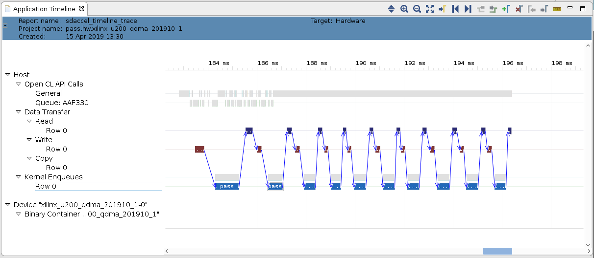
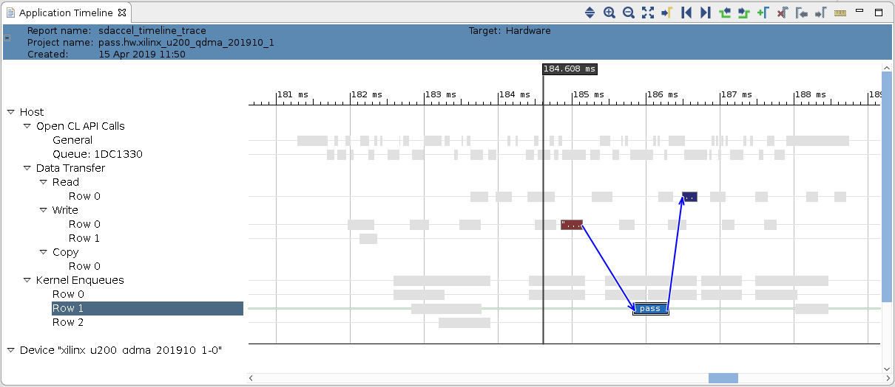
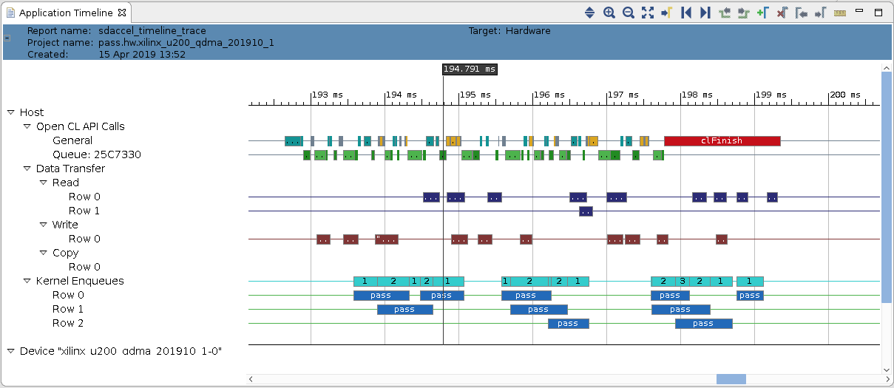
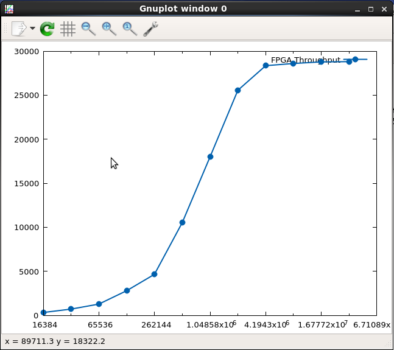

<table>
 <tr>
   <td align="center"><h1>2018.3 SDAccel™ Development Environment Tutorials</h1>
   <a href="https://github.com/Xilinx/SDAccel-Tutorials/branches/all">See other versions</a>
   </td>
 </tr>
 <tr>
 <td align="center"><h3>Host Code Optimization</h3>
 </td>
 </tr>
</table>

## Introduction

This tutorial concentrates on performance tuning of the host code associated with an FPGA Accelerated Application. Host code optimization is only one aspect of performance optimization, which also includes the following disciplines:
* Host program optimization
* Kernel code optimization
* Topological optimization
* Implementation optimization

In this tutorial, you will operate on a simple, single, generic C++ kernel implementation. This allows you to eliminate any aspects of the kernel code modifications, topological optimizations, and implementation choices from the analysis of host code implementations.
>The host code optimization techniques shown in this tutorial are limited to aspects for optimizing the accelerator integration. Additional common techniques, which allow for the utilization of multiple CPU cores or memory management on the host code, are not part of this discussion. For more information, see the _SDAccel Profiling and Optimization Guide_ ([UG1207](https://www.xilinx.com/support/documentation/sw_manuals/xilinx2018_3/ug1207-sdaccel-optimization-guide.pdf)).

The following sections focus on the following specific host code optimization concerns:
* Software Pipelining / Event Queue
* Kernel and Host Code Synchronization
* Buffer Size

## Model

The kernel used in this example is created solely for the purpose of host code optimization. It is designed to be static throughout this tutorial, which allows you to see the effects of your optimizations on the host code.  
<!--this could be better suited as a table-->

The C++ kernel has one input and one output port. These ports are 512 bits wide to optimally utilize the AXI bandwidth. The number of elements consumed by kernel per execution is configurable through the `numInputs` parameter. Similarly, the `processDelay` parameter can be used to alter the latency of the kernel. The algorithm increments the input value by the value for `ProcessDelay`. However, this increment is implemented by a loop executing `processDelay` times incrementing the input value by one each time. Because this loop is present within the kernel implementation, each iteration will end up requiring a constant amount of cycles, which can be multiplied by the `processDelay` number.

The kernel is also designed to enable AXI burst transfers. The kernel contains a read and a write process, executed in parallel with the actual kernel algorithm (`exec`) towards the end of the process.
The read and the write process initiates the AXI transactions in a simple loop and writes the received values into internal FIFOs, or reads from internal FIFOs and writes to the AXI outputs. The Vivado high-level synthesis (HLS) implements these blocks as concurrent parallel processes, since the DATAFLOW pragma was set on the surrounding `pass_dataflow` function.

## Building the Kernel
>**NOTE**: All instructions in this tutorial are intended to be run from the `reference-files` directory.

Although some host code optimizations perform well with the hardware emulation, accurate run-time information and running of large test vectors will require the kernel to be executed on the actual system. Generally, the kernel is not expected to change during host code optimization; this is a one-time hit, and it can easily be performed before the hardware model is finalized.

For this tutorial, an example kernel was set up to build the hardware bitstream one time by issuing the following commands:<!--ThomasB: Would be nice to add the specific string for U200 as an example.-->
```
make TARGET=hw DEVICE=<device> kernel
```
Replace `device` with the device file (`.xpfm`) for the Xilinx® acceleration card you have installed.  
>**NOTE**: This build process will take several hours, and the kernel compilation must be completed before you can analyze the host code impact.

## Host Code

Before examining different implementation options for the host code, view the structure of the code. The host code file is designed to let you focus on the key aspects of host code optimization. Three classes are provided through header files in the common source directory (`srcCommon`):

* `srcCommon/AlignedAllocator.h`: `AlignedAllocator` is a small struct with two methods. This struct is provided as a helper class to support memory-aligned allocation for the test vectors. Memory-aligned blocks of data can be transferred much more rapidly, and the OpenCL™ library will create warnings if the data transmitted is not memory-aligned.

* `srcCommon/ApiHandle.h`: This class encapsulates the main OpenCL objects:
  * the context
  * program
  * `device_id`
  * the execution kernel
  * `command_queue`  
These structures are populated by the constructor, which steps through the default sequence of OpenCL function calls. There are only two configuration parameters to the constructor:
      * A string containing the name of the bitstream (`xclbin`) to be used to program the FPGA.
      * A boolean to determine if an out-of-order queue or a sequential execution queue should be created.

  The class provides accessory functions to the queue, context, and kernel required for the generation of buffers and the scheduling of tasks on the accelerator. The class also automatically releases the allocated OpenCL objects when the `ApiHandle` destructor is called.

* `srcCommon/Task.h`: An object of class `Task` represents a single instance of the workload to be executed on the accelerator. Whenever an object of this class is constructed, the input and output vectors are allocated and initialized based on the buffer size to be transferred per task invocation. Similarly, the destructor will de-allocate any object generated during the task execution.
>**NOTE**:This encapsulation of a single workload for the invocation of a module allows this class to _also_ contain an output validator function (`outputOk`).

   The constructor for this class contains two parameters:
    * `bufferSize`: Determines how many 512 bit values are transferred when this task is executed.
    * `processDelay`: Provides the similarly-named kernel parameter, and it is also used during validation.

  The most important member function of this class is the `run`-function. This function enqueues OpenCL with three different steps for executing the algorithm:
    1. Writing data to the FPGA accelerator
    2. Setting up the kernel and running the accelerator
    3. Reading the data back from the DDR memory on the FPGA

  To perform this task, buffers are allocated on the DDR for the communication. Additionally, events are used to express the dependency between the different task (write before execute before read).

In addition to the ApiHandle object, the `run`-function has one conditional argument. This argument allows a task to be dependent on a previously-generated event. This allows the host code to establish task order dependencies, as illustrated later in this tutorial.

None of the code in any of these header files will be modified during this tutorial. All key concepts will be shown in the different `host.cpp` files, as found in:
* `srcBuf`
* `srcPipeline`
* `srcSync`

However, even the main function in the `host.cpp` file follows a specific structure, which is described in the following section.

### host.cpp Main Functions
The main function contains the following sections marked in the source accordingly.

1. Environment / Usage Check
2. Common Parameters:
   * `numBuffers`: Not expected to be modified. This parameter is used to determine how many kernel invocations are performed.
   * `oooQueue`: If true, this boolean value is used to declare the kind of OpenCL eventqueue that is generated inside of the ApiHandle.
   * `processDelay`: This parameter can be used to artificially delay the computation time required by the kernel. This parameter will not be utilized in this version of the tutorial.
   * `bufferSize`: This parameter is used to declare the number of 512 bit values to be transferred per kernel invocation.
   * `softwarePipelineInterval`: This parameter is used to determine how many operations are allowed to be prescheduled before synchronization occurs.
3. Setup: To ensure that you are aware of the status of configuration variables, this section will print out the final configuration.
4. Execution: In this section, you will be able to model several different host code performance issues. These are the lines you will focus on for this tutorial.
5. Testing: After execution has completed, this section performs a simple check on the output.
6. Performance Statistics: If the model is run on an actual accelerator card (not emulated), the host code will calculate and print the performance statistics based on system time measurements.

>**NOTE:** The setup, as well as the other sections, can print additional messages recording the system status, as well as overall `PASS` or `FAIL` of the run.

### Pipelined Kernel Execution Using Out of Order Event Queue

In this first exercise, you will look at pipelined kernel execution.
>**NOTE:** You are dealing with a single compute unit (instance of a kernel), as a result at each point, only a single kernel can actually run in the hardware. However, as described above, the run of a kernel also requires the transmission of data to and from the compute unit. These activities should be overlapped to minimize the idle-time of the kernel working with the host application.

Start by compiling and running host code (`srcPipeline/host.cpp`):

```
make TARGET=hw DEVICE=<device> pipeline
```

Again, ``<device>`` should be replaced by the actual device file (`.xpfm`) for your available accelerator card. Compared to the kernel compilation time, this will seem like an instantaneous action.

Look at the execution loop in the host code:

```
  // -- Execution -----------------------------------------------------------

  for(unsigned int i=0; i < numBuffers; i++) {
    tasks[i].run(api);
  }
  clFinish(api.getQueue());
```
<!--ThomasB: Formatting should be cpp, not bash-->
In this case, the code schedules all the buffers and lets them execute. Only at the end does it actually synchronize and wait for completion.

After the build has completed, you can run the host executable using the following command:

```
make TARGET=hw DEVICE=<device> pipelineRun
```

This script is set up to run the application, and then spawn the SDaccel GUI. The GUI will automatically be populated with the collected run-time data.

The run-time data is generated by using the `sdaccel.ini` file, which includes the following contents:

```
[Debug]
profile=true
timeline_trace=true
data_transfer_trace=coarse
stall_trace=all
```

Details of the `sdaccel.ini` file can be found in the _SDAccel Environment User Guide_ ([UG1023](https://www.xilinx.com/support/documentation/sw_manuals/xilinx2018_2/ug1023-sdaccel-user-guide.pdf)).

The Application Timeline viewer illustrates the full run of the executable. The three main sections of the timeline are:
* OpenCL API Calls
* Data Transfer section
* Kernel Enqueues

Zoom in on the section illustrating the actual accelerator execution, and select one of the kernel enqueues to see an image similar to the following:


The blue arrows identify dependencies, and you can see that every Write/Execute/Read task execution has a dependency on the previous Write/Execute/Read operation set. This effectively serializes the execution.

Looking back at the execution loop in the host code, no dependency is specified between the Write/Execute/Read runs. Each call to **run** on a specific task only has a dependency on the apiHandle, and is otherwise fully encapsulated.

In this case, the dependency is created by using an ordered queue. In the parameter section, the `oooQueue` parameter is set to `false`:<!--ThomasB: Formatting should be cpp, not bash-->

```
  bool         oooQueue                 = false;
```

You can break this dependency by changing the out-of-order parameter to `true`:<!--ThomasB: Formatting should be cpp, not bash-->

```
  bool         oooQueue                 = true;
```

Recompile and execute:

```
make TARGET=hw DEVICE=<device> pipeline
make TARGET=hw DEVICE=<device> pipelineRun
```

Zooming in on the Application Timeline and clicking any kernel enqueue results in similar to the following figure:



If you select other pass kernel enqueues, you will see that all 10 of them are now showing dependencies only within the Write/Execute/Read group. This allows the read and write operations to overlap with the execution, and you are effectively pipelining the software write, execute, and read. This can considerably improve overall performance because the communication overhead is happening concurrently with the execution of the accelerator.


## Kernel and Host Code Synchronization

For this step, look at the source code in `srcSync` (`srcSync/host.cpp`), and examine the execution loop. This is the same as in the previous section of the tutorial:<!--ThomasB: Formatting should be cpp, not bash-->

```
  // -- Execution -----------------------------------------------------------

  for(unsigned int i=0; i < numBuffers; i++) {
    tasks[i].run(api);
  }
  clFinish(api.getQueue());
```

In this example, the code implements a free-running pipeline. No synchronization is performed until the end, when a call to `clFinish` is performed on the event queue. While this creates an effective pipeline, this implementation has an issue related to buffer allocation, as well as, execution order.

For example, there could be issues if the `numBuffer` variable is increased to a large number or if it is an unknown number (as would be the case when processing a video stream). In these cases, buffer allocation and memory usage can become problematic. In this example, the host memory is pre-allocated and shared with the FPGA, such that this example will probably run out of memory.

Similarly, as each of the calls to execute the accelerator are independent and un-synchronized (out-of-order queue), it is likely that the order of execution between the different invocations is not aligned with the enqueue order. As a result, if the host code is waiting for a specific block to be finished, this might not occur until much later than expected. This effectively disables any host code parallelism while the accelerator is operating.

To alleviate these issues, OpenCL provides two methods of synchronization:
* `clFinish`call
* `clWaitForEvents` call

First, look at using the `clFinish` call. To illustrate the behavior, you must modify the execution loop, as follows:<!--ThomasB: Formatting should be cpp, not bash-->

```
  // -- Execution -----------------------------------------------------------

  int count = 0;
  for(unsigned int i=0; i < numBuffers; i++) {
    count++;
    tasks[i].run(api);
    if(count == 3) {
	  count = 0;
	  clFinish(api.getQueue());
    }
  }
  clFinish(api.getQueue());
```

Recompile and execute:

```
make TARGET=hw DEVICE=<device> sync
make TARGET=hw DEVICE=<device> syncRun
```

If you zoom into Application Timeline, an image is displayed similar to the following:


The key elements in this figure are the red box named `clFinish`, and the larger gap between the kernel enqueues every three invocations of the accelerator.

The call to `clFinish` creates a synchronization point on the complete OpenCL command queue. This implies that all commands enqueued onto the given queue will have to be completed before `clFinish` returns control to the host program. As a result, all activities (including the buffer communication) will have to be completed before the next set of 3 accelerator invocations can resume. This is effectively a barrier synchronization.

While this enables a synchronization point where buffers can be released and all processes are guaranteed to have completed, it also prevents overlap at the synchronization point.

Look at an alternative synchronization scheme, where the synchronization is performed based on the completion of a previous execution of a call to the accelerator. Edit the `host.cpp` file to change the execution loop, as follows:

```
  // -- Execution -----------------------------------------------------------

  for(unsigned int i=0; i < numBuffers; i++) {
    if(i < 3) {
      tasks[i].run(api);
	} else {
	  tasks[i].run(api, tasks[i-3].getDoneEv());
    }
  }
  clFinish(api.getQueue());
```

Recompile and execute:

```
make TARGET=hw DEVICE=<device> sync
make TARGET=hw DEVICE=<device> syncRun
```

If you zoom into the Application Timeline, an image is displayed similar to the following:


In the later part of the timeline, there are five executions of pass executed without any unnecessary gaps. However, even more telling are the data transfers at the point of the marker. At this point, three packages were sent over to be processed by the accelerator, and one was already received back. Because you have synchronized the next scheduling of Write/Execute/Read on the completion of the first accelerator invocation, you now observe another write operation before any other package is received. This clearly identifies overlapping execution.

In this case, you synchronized the full next accelerator execution on the completion of the execution scheduled three invocations earlier by using the following event synchronization in the `run` method of the class task:<!--ThomasB: Formatting should be cpp, not bash-->

```
    if(prevEvent != nullptr) {
      clEnqueueMigrateMemObjects(api.getQueue(), 1, &m_inBuffer[0],
				 0, 1, prevEvent, &m_inEv);
    } else {
      clEnqueueMigrateMemObjects(api.getQueue(), 1, &m_inBuffer[0],
				 0, 0, nullptr, &m_inEv);
    }
```

While this is the common synchronization scheme between enqueued objects in OpenCL, it is possible to alternatively synchronize the host code by calling:<!--ThomasB: Formatting should be cpp, not bash-->

```
  clWaitForEvents(1,prevEvent);
```

This allows for additional host code computation while the accelerator is operating on earlier enqueued tasks. This is not further explored here, but rather, left to the reader as an additional exercise.  


## OpenCL API Buffer Size

In this last section of this tutorial, you will investigate buffer size impact on total performance. Towards that end, you will focus on the host code in `srcBuf/host.cpp`. The execution loop is exactly the same as the end of the previous section.

However, in this host code file, the number of tasks to be processed has increased to 100. The goal of this change is to get 100 accelerator call to be transferring 100 buffers and reading 100 buffers. This enables the tool to get a more accurate average throughput estimate per transfer.

In addition, a second command line option (`SIZE=`) has been added to specify the buffer size for a specific run. The actual buffer size to be transferred during a single write or read is determined by calculating 2 to the power of the specified argument (`pow(2, argument)`) multiplied by 512 bits.

You can compile the host code by calling:

```
make TARGET=hw DEVICE=<device> buf
```

Run the executable with the following command:

```
make TARGET=hw DEVICE=<device> SIZE=14 bufRun
```

The argument `SIZE` is used as a second argument to the host code executable pass.
>**NOTE**: If `SIZE` is not included, it is set to `SIZE=14` by default. This allows the code to execute the implementation with different buffer sizes and measure throughput by monitoring the total compute time. This number is calculated in the Testbench and reported via the FPGA Throughput output.

To ease this sweeping of the different buffer sizes, an additional Makefile goal was created, and it can be executed through the following command:

```
make TARGET=hw DEVICE=<device> bufRunSweep
```

>**NOTE**: The sweeping script (`auxFiles/run.py`) requires a python installation, which is available in most systems. Executing the sweep will run and record the FPGA Throughput for buffer size arguments of 8 to 19. The measured throughput values are recorded together with the actual number of bytes per transfer in the `runBuf/results.csv` file, which is printed at the end of the makefile execution.

When analyzing these numbers, a step function similar to the following image should be observable:  


This image shows that the buffer size clearly impacts performance and starts to level out around 2 MB.
>**NOTE**: This image is created via gnuplot from the `results.csv` file, and if it is found on your system, it will be displayed automatically after you run the sweep.

Concerning host code performance, this step function identifies a relationship between buffer size and total execution speed. As shown in this example, it is easy to take an algorithm and alter the buffer size when the default implementation is based on a small amount of input data. It does not have to be dynamic and runtime-deterministic, as performed here, but the principle remains the same. Instead of transmitting a single value set for one invocation of the algorithm, you would transmit multiple input values and repeat the algorithm execution on a single invocation of the accelerator.

## Conclusion

This tutorial illustrated three specific areas of host code optimization:
   * Pipelined Kernel Execution using an Out of Order Event Queue
   * Kernel and Host Code Synchronization
   * OpenCL API Buffer Size

You should consider these areas when trying to create an efficient acceleration implementation. The tutorial showed how these performance bottlenecks can be analyzed, and shows one way of how they can be improved.

There are many ways to implement your host code and improve performance in general. This applies to improving host to accelerator performance, and other areas such as buffer management. This tutorial was not complete with respect to all aspects host code optimization.

For more information about tools and processes you can use to analyze the application performance in general, see the _SDAccel Profiling and Optimization Guide_ ([UG1207](https://www.xilinx.com/support/documentation/sw_manuals/xilinx2018_3/ug1207-sdaccel-optimization-guide.pdf)).

<hr/>
<p align="center"><sup>Copyright&copy; 2019 Xilinx</sup></p>
