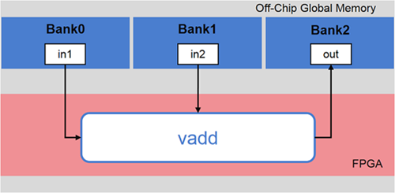
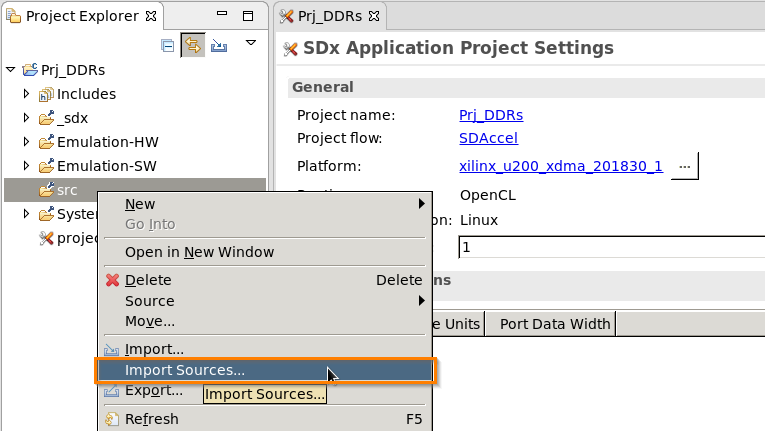
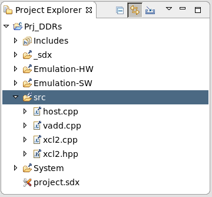
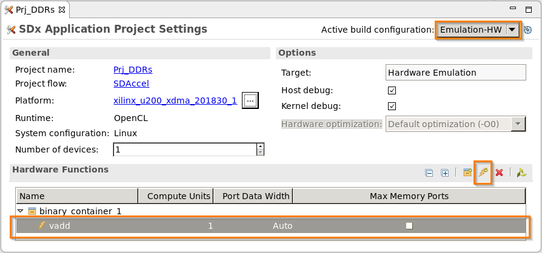
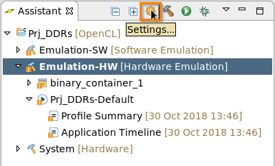
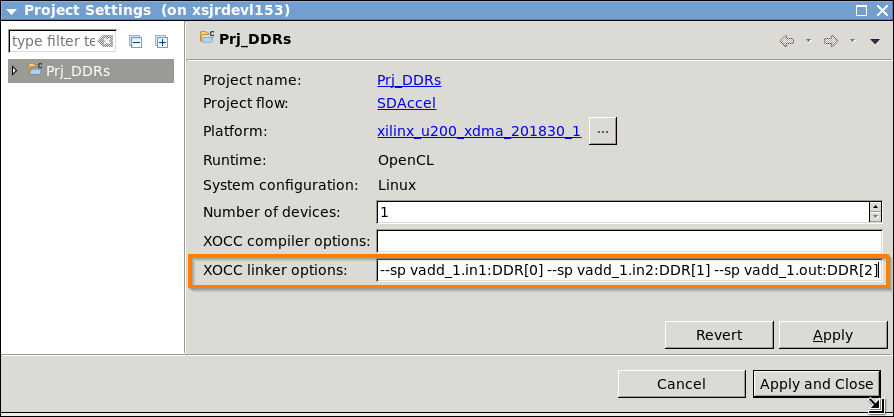
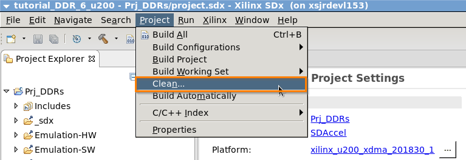

<table>
 <tr>
   <td align="center"><h1>2018.3 SDAccel™ Development Environment Tutorials</h1>
   <a href="https://github.com/Xilinx/SDAccel-Tutorials/branches/all">See other versions</a>
   </td>
 </tr>
 <tr>
 <td align="center"><h3>Using Multiple DDR Banks</h3>
 </td>
 </tr>
</table>

## Introduction

By default, in the SDAccel™ environment, the data transfer between the kernel and the DDR is achieved using a single DDR bank. In some applications, data movement is a performance bottleneck. In cases where the kernels need to move large amounts of data between global memory (DDR) and the FPGA, you can use multiple DDR banks. This enables the kernels to access the various memory banks simultaneously. As a result, the application performance increases.

The System Port mapping option using the `--sp` switch allows the designer to map kernel ports to specific global memory banks, such as DDR or programmable logic RAM (PLRAM). This tutorial shows you how to map kernel ports to multiple DDR banks.

## Example Description

This is a simple example of vector addition. It shows the `vadd` kernel reading data from `in1` and `in2` and producing the result `out`.

In this tutorial, you will implement the vector addition application using three DDR banks.

Because the default behavior of the XOCC compiler is to use a single DDR bank for data exchange between kernels and global memory, all data access through ports `in1`, `in2`, and `out` will be done via the default DDR bank for the platform.  


Assume that in the application, you want to access:
* `in1` via `Bank0`
* `in2` via `Bank1`
* `out` via `Bank2`



In order to achieve the desired mapping, must make the following updates:  
* Modify the host code to use `cl_mem_ext_ptr` with the kernel and argument index.
* Instruct the SDAccel tool to connect each kernel argument to the desired bank.

The example in this tutorial uses a C++ kernel; however, the steps described are also the same for RTL and OpenCL™ kernels.

## Tutorial Setup

1. Launch the SDx™ environment GUI.
	1. Create a workspace directory:
		* `cd mult-ddr-banks`
		* `mkdir workspace`
	2. Open the SDx™ environment in GUI mode:
```
sdx -workspace workspace
```
2. Create a new project:
	1. Select **SDX Application Project** from the menu. The project name should be: **Prj_DDRs**
	2. Select **xilinx_u200_xdma_201830_1** as the platform.
	3. Select **Empty Application**, and click **Finish**
	4. Import the source files for this lab into the `src` directory of the project:  

3. Ensure that the following source files have been imported into the `src` directory. After you expand the `src` directory, it will look like this:  

4. Add the **vadd** hardware function in the SDx Application Project Settings:  

5. Select **Emulation-HW** as the Active build configuration.
6. From the menu, select **Run Configurations**.  

7. In the Arguments tab, select **Automatically add binary container to arguments**.  

8. Apply settings, and build for hardware emulation.  
As mentioned before, the default implementation of the design uses a single DDR Bank. Observe the messages in the Console window during the link step ,and you should see messages similar the ones shown below.  
  
This confirms the mapping is automatically inferred by the SDx environment for each of the kernel arguments in the absence of explicit `--sp` options being specified.
9. Run **HW-Emulation** by clicking on the green Run button. After the simulation is complete, you can see the memory connections for the kernel data transfer under the Guidance tab as shown below:  


Now, you will explore how the data transfers can be split across the following:
* `DDR Bank 0`
* `DDR Bank 1`
* `DDR Bank 2`

## Change Host Code
In the host code, you need to use `cl_mem_ext_ptr` with the kernel and argument index. This is achieved using the Xilinx® vendor extension.

Open the `host.cpp` file, and navigate to the following sections, where the code changes are shown:

```
// #define USE_MULT_DDR_BANKs
...
	// ------------------------------------------------------------------
	// Create Buffers in Global Memory to store data
	//             GlobMem_BUF_in1 - stores in1
	// ------------------------------------------------------------------
#ifndef USE_MULT_DDR_BANKs
#else
	cl_mem_ext_ptr_t  GlobMem_BUF_in1_Ext;
	GlobMem_BUF_in1_Ext.param = krnl_vector_add.get();
	GlobMem_BUF_in1_Ext.flags = 0; // 0th Argument
	GlobMem_BUF_in1_Ext.obj   = source_in1.data();

	cl_mem_ext_ptr_t  GlobMem_BUF_in2_Ext;
	GlobMem_BUF_in2_Ext.param = krnl_vector_add.get();
	GlobMem_BUF_in2_Ext.flags = 1; // 1st Argument
	GlobMem_BUF_in2_Ext.obj   = source_in2.data();

	cl_mem_ext_ptr_t  GlobMem_BUF_output_Ext;
	GlobMem_BUF_output_Ext.param = krnl_vector_add.get();
	GlobMem_BUF_output_Ext.flags = 2; // 2nd Argument
	GlobMem_BUF_output_Ext.obj   = source_hw_results.data();
#endif
```

To assign kernel ports to multiple DDR banks, you will use the `cl_mem_ext_ptr_t` structure.  
Where:
* `param`: The kernel associated with the arugument index.
* `flags`: The argument index associated with the valid kernel.
* `obj`: The allocated host memory for the data transfer.

For example, the memory pointer for `in2` is assigned to the `GlobMem_BUF_in2_Ext` buffer in Global Memory.  
>**NOTE**: If you do not explicitly assign a bank to a buffer, then it goes to a default DDR bank.

Then, during buffer allocation, use the `cl::Buffer API` to make changes shown in the code below (compare to when the Xilinx extension is not used):
```
#ifndef USE_MULT_DDR_BANKs
    OCL_CHECK(err, cl::Buffer buffer_in1   (context,CL_MEM_USE_HOST_PTR | CL_MEM_READ_ONLY,
            vector_size_bytes, source_in1.data(), &err));
    OCL_CHECK(err, cl::Buffer buffer_in2   (context,CL_MEM_USE_HOST_PTR | CL_MEM_READ_ONLY,
            vector_size_bytes, source_in2.data(), &err));
    OCL_CHECK(err, cl::Buffer buffer_output(context,CL_MEM_USE_HOST_PTR | CL_MEM_WRITE_ONLY,
            vector_size_bytes, source_hw_results.data(), &err));
#else
    OCL_CHECK(err, cl::Buffer buffer_in1   (context,CL_MEM_USE_HOST_PTR | CL_MEM_READ_ONLY | CL_MEM_EXT_PTR_XILINX,
            vector_size_bytes, &GlobMem_BUF_in1_Ext, &err));
    OCL_CHECK(err, cl::Buffer buffer_in2   (context,CL_MEM_USE_HOST_PTR | CL_MEM_READ_ONLY | CL_MEM_EXT_PTR_XILINX,
            vector_size_bytes, &GlobMem_BUF_in2_Ext, &err));
    OCL_CHECK(err, cl::Buffer buffer_output(context,CL_MEM_USE_HOST_PTR | CL_MEM_WRITE_ONLY | CL_MEM_EXT_PTR_XILINX,
            vector_size_bytes, &GlobMem_BUF_output_Ext, &err));
#endif
```

To make all changes in the host code, uncomment the `#define USE_MULT_DDR_BANKs` line at the beginning of the host code, and save it.

## Set XOCC Linker Options

Next, you need to instruct the XOCC Kernel Linker to connect the kernel arguments to the corresponding banks. Use the `--sp` option to map kernel ports or kernel arguments.

Kernel ports:
```
--sp <kernel_cu_name>.<kernel_port>:<sptag>
```
Kernel args:
```
--sp <kernel_cu_name>.<kernel_arg>:<sptag>
```
You can also do ranges: ``<sptag>[min:max]``. For convenience, a single index is also supported (e.g., DDR[2]).

* `<kernel_cu_name\>`: The compute unit based on the kernel name, followed by `_` and `index`, starting from the value `1`. For example, the computer unit name of the vadd kernel will be `vadd_1`
* `<kernel_arg\>`: The compute unit's memory interface or function argument. For the `vadd` kernel, the kernel argument can be found in the `vadd.cpp` file.
* `<sptag\>`: Represents a memory resource available on the target platform. Valid sptag names include DDR and PLRAM. In this tutorial, target `DDR[0]`, `DDR[1]`, and `DDR[2]`.


Review the definition of the `--sp` argument for the `vadd` kernel.
* **Kernel**: `vadd`
* **Kernel instance name**: `vadd_1`.

Taking into account that this is a C/C+ kernel, the arguments are specified in the `vadd.cpp` file. This kernel argument's (`in1`, `in2`, and `out`) should be connected to `DDR[0]`, `DDR[1]`, and `DDR[2]`.  
Therefore the `--sp` options should be:
```
--sp vadd_1.in1:DDR[0]
--sp vadd_1.in2:DDR[1]
--sp vadd_1.out:DDR[2]
```
Argument `in1` accesses DDR Bank0, argument `in2` accesses DDR Bank1, and argument `out` accesses DDR Bank2.

>**NOTE**: It is recommended that the `--slr` option is used to assign a compute unit to a specific SLR when assigning DDR banks.  
>The syntax for this option is: `--slr <COMPUTE_UNIT>:<SLR_NUM>`, where `COMPUTE_UNIT` is the name of the compute unit, and `SLR_NUM` is the SLR number to which the compute unit is assigned.  
>For example, `xocc … --slr vadd_1:SLR2` assigns the computer unit named `vadd_1` to SLR2.

When you put all `--sp` options together, you will see:
```
--sp vadd_1.in1:DDR[0] --sp vadd_1.in2:DDR[1] --sp vadd_1.out:DDR[2]
```

>**IMPORTANT**: To avoid mistakes during specification of all these options in the SDAccel GUI, copy these options from the beginning of the `host.cpp` file. Select part of a string starting with `--sp`):

```
// #define USE_MULT_DDR_BANKs
// Note: set XOCC options for Link: --sp vadd_1.in1:DDR[0] --sp vadd_1.in2:DDR[1] --sp vadd_1.out:DDR[2]
```

To specify these options for XOCC Linker, from the Assistant window, click **Settings**:  


In the Project Settings dialog box, specify the **XOCC linker options** by pasting the `--sp` options that were copied earlier:  


After you click **Apply**, close the Project Settings window. Complete a clean build of the project in **HW Emulation** mode, by clicking **Project**->**Clean…**.  


Again, observe the messages in the Console window during the link step; you should now see messages similar to the following image:  


This confirms that the SDAccel environment has correctly mapped the kernel arguments to the specified DDR banks from the `--sp` options that were provided.

Now, run HW-Emulation by clicking on the green Run button, and then verify the correctness of the design. After the simulation is complete, click **Guidance** to see the memory connections for the kernel data transfer, as shown below.  


## Conclusion

This tutorial showed you how to change the default mapping of ports `in1`, `in2`, and `out` of kernel `vadd` from a single DDR bank to multiple DDR banks. You also learned how to:

* Define the host pointers, and assign host pointers to `cl:Buffer` APIs.
* Set XOCC linker options using the `--sp` switch to bind kernel arguments to multiple DDR banks.
* Build the application and verify DDR mapping.

<hr/>
<p align="center"><sup>Copyright&copy; 2019 Xilinx</sup></p>
