<table style="width:100%">
  <tr>
    <th width="100%" colspan="6"><h1>SDAccel Development Environment Getting Started Tutorial</h2>
</th>
  </tr>
  <tr>
    <td align="center"><a href="README.md">Introduction</td>
    <td align="center">Lab 1: Introduction to the SDAccel Development Environment</td>
    <td align="center"><a href="lab-2-introduction-to-the-sdaccel-makefile.md">Lab 2: Introduction to the SDAccel Makefile</a></td>
  </tr>
</table>

## Lab 1: Introduction to the SDAccel Development Environment  

This lab uses an example from the Xilinx® SDAccel™ Example GitHub repository, which can be found [here](https://github.com/Xilinx/SDAccel_Examples). This lab demonstrates two different flows: steps 1-3 explain the GUI flow, while step 4 explains the Makefile flow.

<strong>Step 1: Creating an SDAccel Project From a Github Example</strong>

  1. Use the `sdx` command to launch SDx&trade; in a Terminal window in Linux.
     The Workspace Launcher dialog box appears.  

       

  2. Select a location for your workspace; this is where the project will reside.  

  3. Click **OK**.   
     The SDx Welcome Window opens. Note that the Welcome Window opens when you use the tool for the first time, or by selecting **Help > Welcome**.

       

  4. In the SDx Welcome window, click **Create SDx Project**.  
     The Create a New SDx Project dialog box opens.  

     

  5. Select **Application** and click **Next**.
     The New SDx Project dialog box opens.

       

  6. Specify the name and location for your project. For this project, type `helloworld` into the Project Name field and select **Use default location**.
     The Hardware Platform dialog box opens.  

     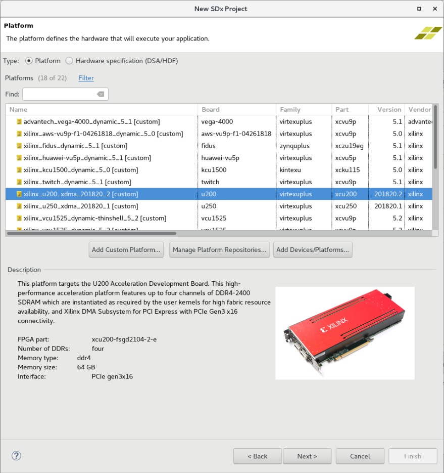

  7. Select the `xilinx_u200_xdma_201820_2` platform and click **Next**.  
     The selection of the hardware platform defines the project as an SDAccel project or an SDSoC project. In this case you have selected an SDAccel acceleration platform, so the project will be an SDAccel project.

     The System Configuration window opens. This window is where you define what type of system and runtime to use.  

       

  8. For this lab, use the system configuration defaults, which are set to Linux and OpenCL.   

  9. Click **Next**.  
     The Templates window opens, showing a list of possible templates that you can use to get started in building an SDAccel project. Unless you have already downloaded other SDx examples, you should only see Empty Application and Vector Addition. In this lab, you will be using the Helloworld example from the Github repository. To do this you need to download the examples.  

       

  10. Click **SDx Examples**.  
      The SDx Examples window shows that you can download both the SDAccel Examples and SDSoC Examples.  

        

  11. Click the **Download** button for the SDAccel Examples and the system will begin to clone the Github repository to the location designated in the Details.  
      >**:pushpin: NOTE:**  The download can take a while depending on connectivity speeds. The Progress Information dialog will be present until the cloning of the repository is complete.  

      When the download completes, you will see the SDAccel Examples tree table populated and expanded.  

        

  12. Click **OK** to close the window and go back to the Templates window.  
      The Templates window is now populated with the SDAccel Github examples.  

      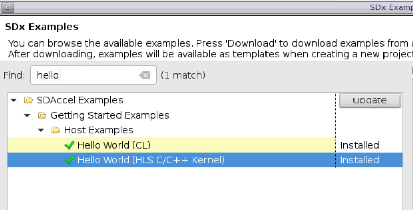  

  13. Using the Find window, type hello, and locate the Helloworld (HLS C/C++ Kernel) from the Host Examples.   

  14. Click **Finish**.  
      The Hello world project is created and opened in the SDAccel environment, given the name that you specified for the project. The environment should appear similar to the following figure.

      

      The SDAccel Environment includes the Eclipse-based SDx IDE which you have been working in. As shown in the figure, the default perspective has an arrangement of the Project Explorer view, Project Editor window, and the Outline view across the top, and the Assistant view, the Console view, and Target Connections view across the bottom. Refer to the SDAccel Environment User Guide ([UG1023](https://www.xilinx.com/cgi-bin/docs/rdoc?v=2018.2;d=ug1023-sdaccel-environment-user-guide.pdf)) for more information on the features of the SDx IDE.

  

<strong>Step 2: Running Software Emulation</strong>

This step shows you how to run software emulation for a design, by setting Run Configuration settings, opening reports, and showing how to launch Debug. You can find details about reports and Debug in the SDAccel Environment User Guide   ([UG1023](https://www.xilinx.com/cgi-bin/docs/rdoc?v=2018.2;d=ug1023-sdaccel-environment-user-guide.pdf)).  

  1. To run CPU Emulation, go to Application Project Settings and ensure that Active build configuration is set to Emulation-SW.  

     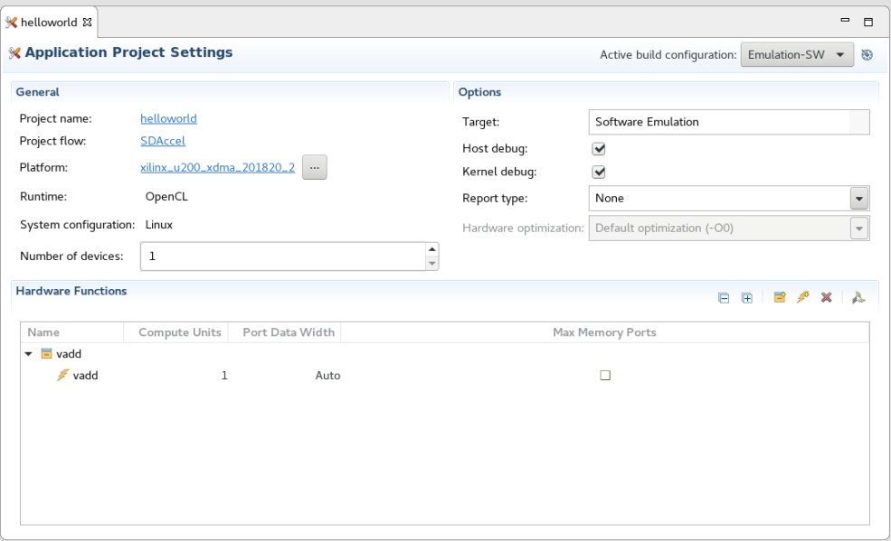  

  2. From the Github example, an accelerator already exists for the design. To add a hardware function to a design that does not have one, start by clicking on the Add Hardware Function button: . This analyzes the C/C++ code and determines functions that can be used for acceleration.  

  3. Click the Run button:  to run software emulation. This builds the project before running the emulation.  

     >**:pushpin: NOTE:**  The build and emulation process can take a few minutes or longer to complete. In the mean time, open the Run Configurations dialog box to see how you can add specific command line options to customize your build.  

  4. Go to the Run menu and select **Run Configurations**.  

  5. Under the Arguments tab, the Program arguments field allows you to add XOCC command line flags and switches. Refer to the SDx Command and Utility Reference Guide ([UG1279](https://www.xilinx.com/cgi-bin/docs/rdoc?v=2018.2;d=ug1279-sdx-command-utility-reference-guide.pdf)) for a description of command options. In this tutorial, no command line arguments are needed for the design to function.  

  6. In the Profile tab, there is a drop-down menu for Generate timeline trace report. You can click on the options to see what types of reports are generated. There is also a box for Enable Profiling in this tab. Close the window without changing anything.  
     >**:pushpin: NOTE:**  If you make changes to the Run Configurations dialog box, re-run the current emulation step in order to see the changes. You can do this by clicking the **Run** button.  

  7. The Console window should now show TEST PASSED.   

  8. After the emulation run is complete, you can review the Profile Summary and Application Timeline reports for details on further optimizations. In the Assistant window, double-click Profile Summary as shown in the figure.

     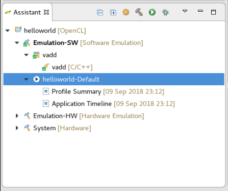

     Here, you can view operations, execution time, bandwidth, and other useful data that you can use to optimize the design. Note that your summary numbers may vary from the following figure.  

     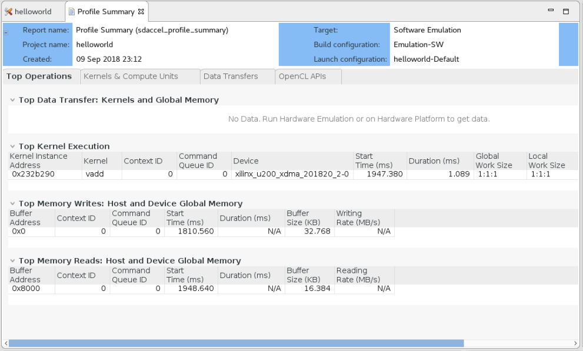  

  9. To view the Application Timeline report, in the Assistant window, double-click Application Timeline. This shows a breakdown of the host code and the kernel code, and execution time for each. To zoom into a specific area, click and drag the mouse to the right.

       

  10. The Profile Summary and Application Timeline present data on how the host code and kernel communicate and process kernel information. Using the Debug feature can help you to step through host-kernel processing to pinpoint issues. In the Project Explorer window double-click **host.cpp** (located in the `Explorer > src` directory) to open the file in the editor.  

  11. To run in Debug, you need to set a breakpoint. Setting breakpoints at key points in the execution helps identify problems. To pause the host code right before kernel debug begins, right-click on (line 70 NEED_TO_BE_CHANGED) in the blue area (see figure below) on the (`outBufVec.push_back(buffer_C) NEED_TO_BE_CHANGED`) and select Toggle Breakpoint.  

        

  12. To run Debug, click the Debug icon: . A dialog box opens up asking you to switch to that perspective. Click Yes.  

  13. Using Eclipse debugging, you can examine the host and kernel code in more detail. All the controls for step-by-step debugging are in the Run menu or on the main toolbar menu.

      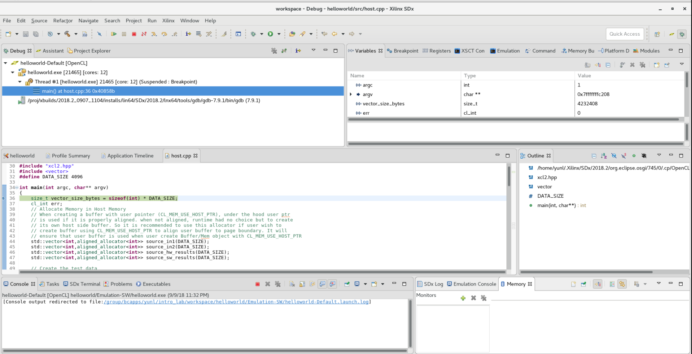  

  14. By default, the debugger inserts an automatic breakpoint at the first line of `main`. On the Debugger tab of the Runs Configuration dialog, there is an option to stop on the `main` function which is enabled by default as shown in the figure. This is helpful in case of a problematic function in need of more thorough debugging. Press F8 to resume to the next breakpoint or from the Run menu select Resume.  

      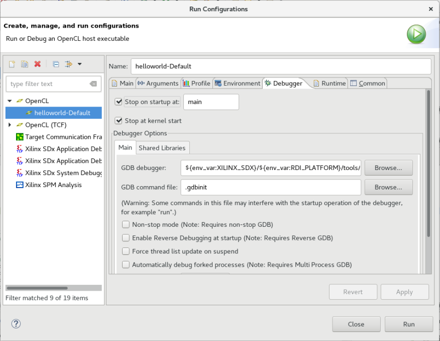  

  15. After resuming debugging, SDx launches another gdb instance for the kernel code, and it also has a breakpoint at the beginning of the function. This allows for detailed analysis of the kernel and how the data looks being read into the function, and written out to memory. Once the kernel execution is done in gdb, that instance is terminated and you return to the main debugging thread. Press F8 to continue.  
      >**:pushpin: NOTE:**  The console view still shows the kernel debug outputs. Click the icon  to go back to the vadd.exe console and see the output from the host code.  

  16. Close the Debug Perspective by going to the upper-right of the window where it shows the Debug  button, right-click, and select **Close**, or use the SDx button  to switch to the standard SDx perspective.

  17. Once back into the main SDx Perspective, close all tabs in the center Project Editor window except the Application Project Settings window.

<strong>Step 3: Running Hardware Emulation</strong>

This step covers running Hardware Emulation feature, as well as looking at the basics of profiling and reports.  

  1. To run Hardware Emulation, go to SDx Application Settings and make sure that Active build configuration is set to Emulation-HW, then click Run. This takes some time to complete.  
     >**:pushpin: NOTE:**  The main difference between Emulation-SW and Emulation-HW is that emulating hardware builds a design that is closer to what is seen on the platform, synthesizing RTL for the kernel code. This means data related to bandwidth, throughput, and execution time are more accurate. This causes the design to take longer to compile.  

  2. In the Assistant tab, open System Estimate under the Emulation-HW configuration.
     This text report provides information related to kernel information, timing about the design, clock cycles, and area used in the device.

     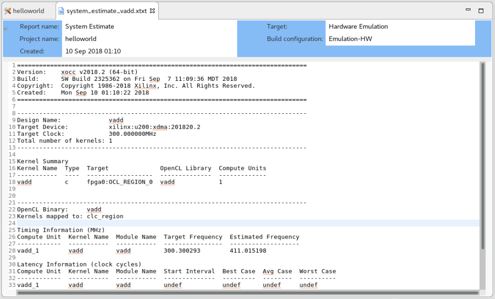  

  3. In the Reports tab, open Profile Summary. This summary report provides detailed information related to kernel operation, data transfers, and OpenCL™ API calls, as well as profiling information related to the resource usage, and data transfer to/from the kernel/host.
     >**:pushpin: NOTE:**  The simulation models used in HW Emulation are approximate. Profile numbers shown are just an estimate and might vary from results obtained in real hardware.  

     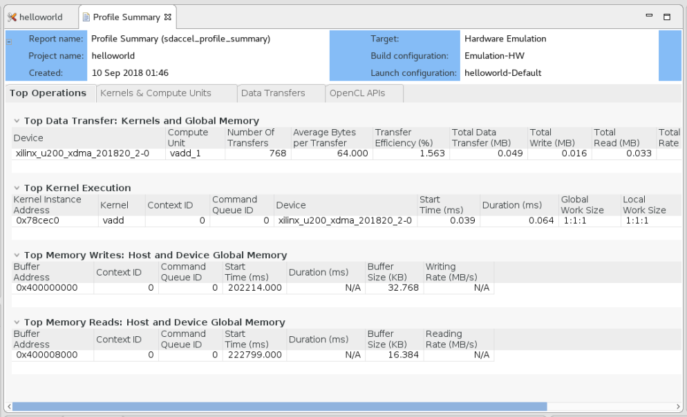

  4. Next to the console tab, there is a tab labeled Guidance. This is where unmet checks provide some information on how to optimize the kernel.

     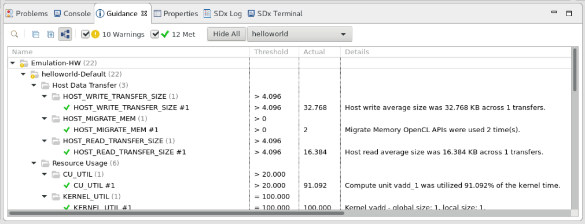  

     >**:pushpin: NOTE:**  To see other performance optimization techniques and methodologies, refer to the  SDAccel Profiling and Optimization Guide ([UG1207](https://www.xilinx.com/cgi-bin/docs/rdoc?v=2018.2;d=ug1207-sdaccel-optimization-guide.pdf)).  

  5. Open the Application Timeline report.  
     This report shows the estimated time it takes for the host and kernel to complete the task and provides finer grained information on where bottlenecks can be. In this example, it is iterated twice and this timeline shows the kernel is run twice. Adding a marker, zooming, and expanding signals can help in identifying bottlenecks.  

     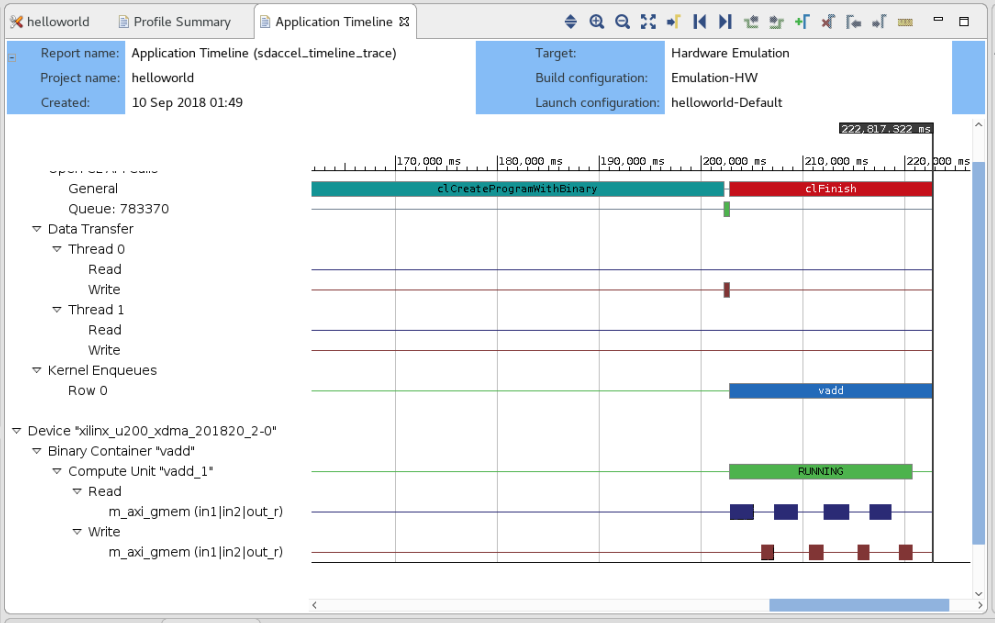  

  6. Open the HLS Report by expanding the Emulation-HW tab and then expanding the relevant kernel tab.
     This report provides detailed information provided by Vivado® HLS on the kernel transformation and synthesis. The tabs at the bottom provide more information on where most of the time is spent in the kernel and other performance related data. Some performance data might include latency and clock period.  

     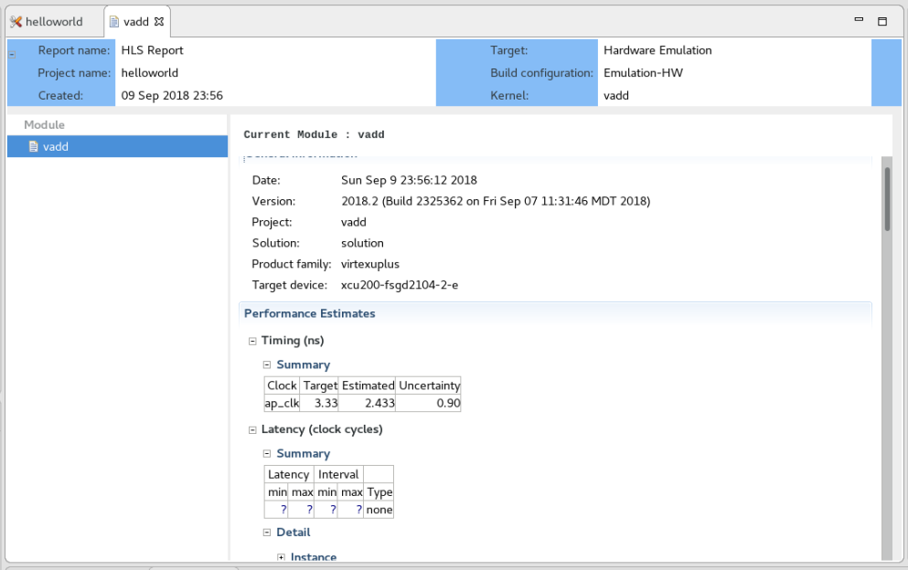  

<strong>Step 4: Makefile Flow</strong>

This step explains the basics of the Makefile flow and how SDx™ uses it. The  
advantages of using this flow include:  

  * Easy automation into any system  
  * Faster turnaround time on small design changes  

To run the makefile flow, do the following:  

  1. In the Project Explorer, navigate to the Emulation-SW directory and look for the makefile file. Double-click the file to open it in the editor.  
     The SDx IDE creates this makefile and uses it for building and running emulations. Alternatively, you can navigate to the Emulation-HW directory and look for the makefile file.  

  2. Notice that there is a unique makefile for each build. In the opened makefile in the editor window, look at line 21. Note that it specifies a target if either `hw_emu` or `sw_emu`.   

     >**:information_source: TIP:**: You can also use the makefile produced by the SDx IDE to build the project outside of the GUI.   

  3. Open up a new terminal session and navigate to the workspace.

  4. Navigate to the Emulation-SW directory and type: `make incremental`. The process produces a typical SDx log output.  

     >**:pushpin: NOTE:** If no changes are made to the host or kernel code, this will do nothing because the compilation is already completed. It will output a warning like: make: Nothing to be done for `incremental'.  

[Lab 2: Introduction to the SDAccel Makefile](./lab-2-introduction-to-the-sdaccel-makefile.md) goes into more detail on how to use the makefile and command line flow.  

### Summary

After completing this tutorial, you should be able to do the following:  

* Create an SDAccel project from a Github example design.
* Create a binary container and accelerator for the design.  
* Run Software Emulation and use the Debug environment on host and kernel code.  
* Run Hardware Emulation and use the reports to understand possible optimization.  
* Understand differences between Software and Hardware Emulation reports.  
* Read the project makefile and run the makefile command line.  

  

  
Copyright&copy; 2018 Xilinx

